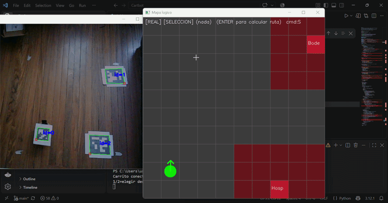
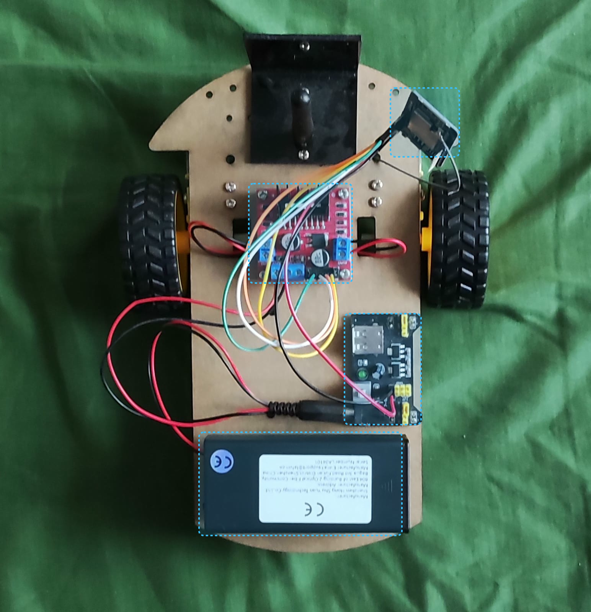

# Cartbot
Robot móvil autónomo con navegación por visión artificial, A* y planificación de misiones (TSP).
 

<div align="center">

|        **Autor**     | **Contacto**|
|:---------------------------:|:---------------------:|
|    Anthony Calvo García      |  anthonycalvo50@gmail.com |

</div>

## Demostración



El sistema ordena los destinos con TSP, calcula la ruta con A* y corrige
el rumbo con la cámara en cada paso.


**Tecnologías:** Python · OpenCV · NumPy · ESP32 · Arduino IDE · TCP/WiFi

## Descripción general del dispositivo
 
El robot autónomo navega entre distintos puntos de un escenario usando una
cámara como único sensor. Una computadora procesa la imagen, ubica
al robot y a los objetivos mediante marcadores ArUco, calcula las rutas y
envía comandos de movimiento al carrito por WiFi. El ESP32 del carrito solo
ejecuta esos comandos; toda la inteligencia vive en la computadora.
 
El sistema resuelve dos problemas distintos: **cómo** ir de un punto a otro
esquivando obstáculos (algoritmo A*) y **en qué orden** visitar varios
objetivos para recorrer la menor distancia posible (TSP).
 
El sistema es capaz de reaccionar de forma dinámica, por lo que, si algún objeto se mueve durante el proceso, se recalcula la ruta apuntando a la nueva ubicación.

## Requisitos
 
- Python con OpenCV y NumPy
- ESP32
- Cámara USB ubicada sobre el escenario
- Marcadores ArUco (diccionario DICT_6X6_250)

## Instalación y uso

```bash
pip install opencv-python numpy
```

1. Cargar `carrito_esp32.ino` en el ESP32 y conectar la computadora a la red `CarritoIA`.
2. `python homography.py` — calibrar la cámara (una sola vez, con la cámara ya montada).
3. `python mision_tsp.py` — elegir destinos y ejecutar una misión completa.


## Estructura del proyecto

| Archivo | Función |
|---|---|
| `ArUco.py` | Genera los marcadores ArUco del carrito y de los objetivos. |
| `Camara.py` | Comprueba la conexión de la cámara USB con la computadora. |
| `aruco_detector.py` | Detecta los marcadores y calcula su centro y orientación. |
| `homography.py` | Convierte los píxeles de la cámara en coordenadas reales del piso. |
| `localizador.py` | Asigna a cada marcador su celda en el mapa. |
| `mapa.py` | Reconstruye el mapa lógico en cada cuadro e infla un margen de seguridad alrededor de los obstáculos. |
| `planner.py` | Algoritmo A*: ruta más corta entre dos celdas esquivando obstáculos. |
| `vista_ruta.py` | Calcula la celda de llegada al frente de cada objetivo y dibuja la ruta. |
| `tsp.py` | Calcula el orden óptimo de visita de varios objetivos. |
| `control.py` | Control en lazo cerrado: corrige el rumbo en cada paso con la visión. |
| `mision_tsp.py` | Programa principal: integra todos los módulos y ejecuta la misión. |
| `teleop.py` | Control manual para probar el hardware y la comunicación. |

 
## Código en el ESP32
 
Funciona para el movimiento básico del carrito dirigido desde la computadora,
controlando la velocidad de avance y la velocidad de giro. Genera su propia
red WiFi y se comunica por TCP, deteniéndose de forma automática si la
comunicación falla.
 
 
 
## Imágenes del carrito
 
 
### Vista superior

 
### Vista inferior


