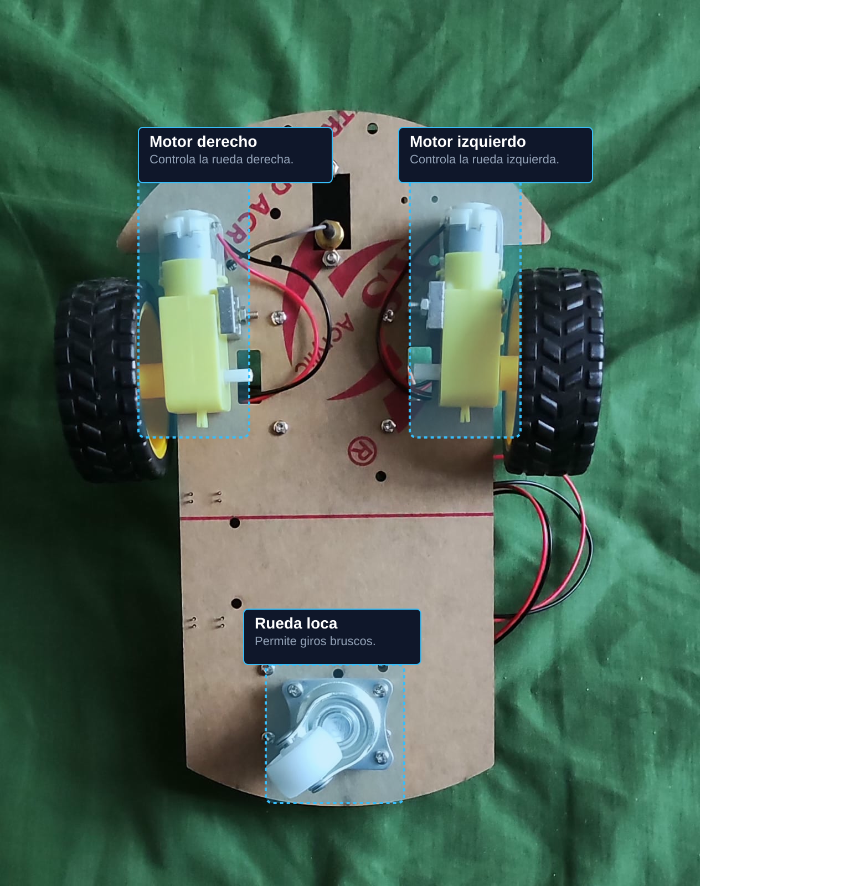

# Cartbot
Robot móvil autónomo con navegación por visión artificial, A* y planificación de misiones (TSP).

## Descripción general del dispositivo

El robot autónomo navega entre distintos puntos de un escenario usando una
cámara como único sensor. Una computadora procesa la imagen, ubica
al robot y a los objetivos mediante marcadores ArUco, calcula las rutas y
envía comandos de movimiento al carrito por WiFi. El ESP32 del carrito solo
ejecuta esos comandos; toda la inteligencia vive en la computadora.

El sistema resuelve dos problemas distintos: **cómo** ir de un punto a otro
esquivando obstáculos (algoritmo A*) y **en qué orden** visitar varios
objetivos para recorrer la menor distancia posible (TSP).

## Requisitos

- Python con OpenCV y NumPy
- ESP32 con Arduino core 3.x
- Cámara USB ubicada sobre el escenario
- Marcadores ArUco (diccionario DICT_6X6_250)

## Uso

1. `python homography.py` — calibrar la cámara (una sola vez, con la cámara ya montada)
2. `python mision_tsp.py` — ejecutar una misión completa

## Descripción de los archivos

### ArUco (generador)
Genera los marcadores ArUco que se usan para ubicar tanto al carrito como a
los objetivos.

### Camara
Comprueba la correcta integración de la cámara USB con la computadora.

### aruco_detector
Detecta los marcadores ArUco en la imagen y calcula su centro y orientación.
Otros módulos lo usan como base para la localización.

### homography
Convierte los pixeles provenientes de la camara en coordenadas las cuales son utilizadas para la ubicacion de los objetos.

### localizador
Asigna a cada objeto (representado por un ArUco) su posición en el mapa.

### mapa
Reconstruye el mapa lógico, que cambia dinámicamente conforme se mueven los
objetos del escenario. Marca cada edificio como obstáculo e infla un margen
de seguridad alrededor por el tamaño del carrito.

### planner
Implementa el algoritmo A*, que calcula la ruta más corta entre dos puntos
del mapa esquivando obstáculos.

### vista_ruta
Calcula la celda de aproximación al frente de cada edificio y dibuja la ruta
sobre el mapa. La ruta se recalcula en cada cuadro, así que los objetos se
pueden mover durante la operación.

### control
Controla el carrito en lazo cerrado: corrige el rumbo en cada paso con la
visión para que llegue y se detenga en el lugar requerido.

### tsp
Calcula el orden óptimo para visitar varios objetivos, minimizando la
distancia total de recorrido.

### mision_tsp
Integra todo el sistema: permite elegir varios destinos, ordenarlos con el
TSP y ejecutar la misión completa. Reúne los demás módulos (mapa, planner,
control, tsp) en una sola aplicación.

### teleop
Opera el carrito de forma manual, para comprobar que el hardware y la
comunicación funcionan antes de la navegación autónoma.

### carrito_esp32 (firmware)
Firmware del ESP32: crea una red WiFi propia, recibe los comandos por TCP y
controla los motores con el driver L298N.

## Código en el ESP32

Funciona para el movimiento básico del carrito dirigido desde la computadora,
controlando la velocidad de avance y la velocidad de giro. Genera su propia
red WiFi y se comunica por TCP, deteniéndose de forma automática si la
comunicación falla.

## Imagenes interactivas del carrito.

### Vista Superior

---

### Vista Secundaria / Perspectiva
